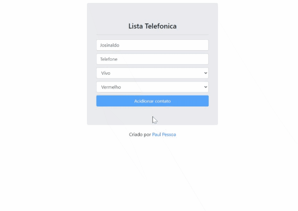
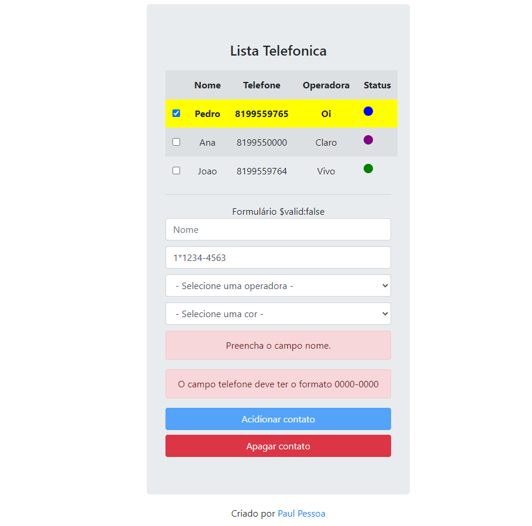

# Simple Angular Phone List

## Diretivas AngularJs:

- [x] ngApp
- [x] ngBind
- [x] ngModel
- [ ] ngController
- [x] ngRepeat
- [x] ngClick
- [x] ngDelete
- [x] ngDisabled
- [x] ngOptions
- [x] ngClass
- [x] ngStyle
- [x] ngShow & ngHide
- [x] ngIf
- [x] ngInclude
- [x] ngMinlength & ngMaxlength
- [x] ngPattern

## Scope AngularJs:

- [x] $invalid & $valid
- [x] $dirty
- [x] $error

## Modules AngularJs:

- [ ] ngMessages - ngMessage

## Filters AngularJs:

- [x] upperCase - lowerCase
- [x] date
- [x] orderBy
